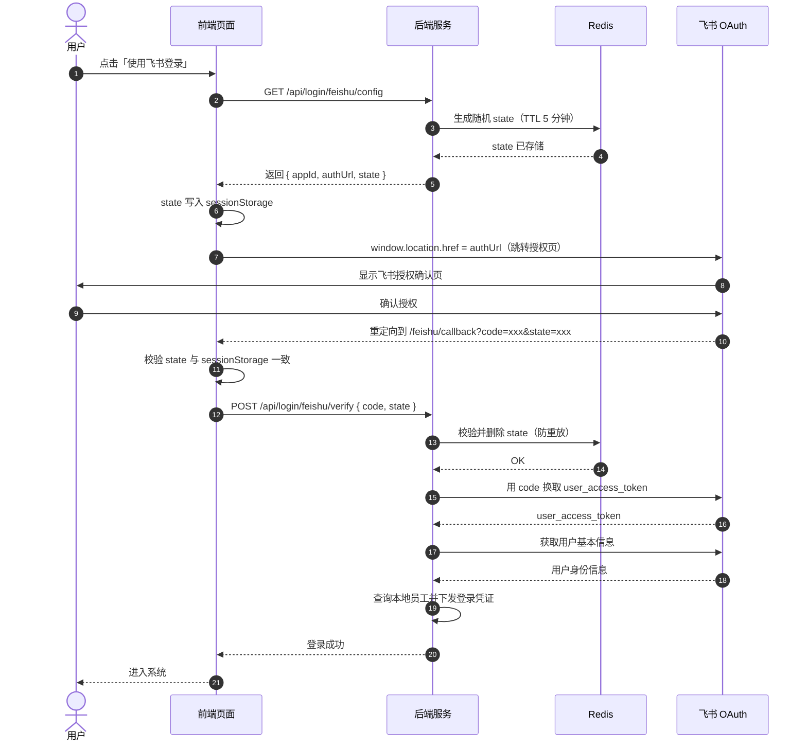
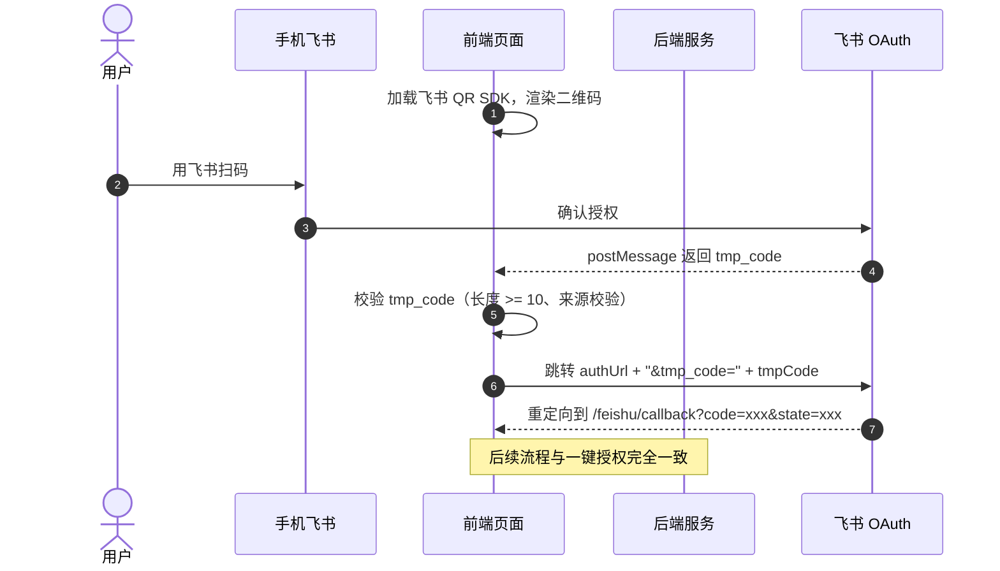
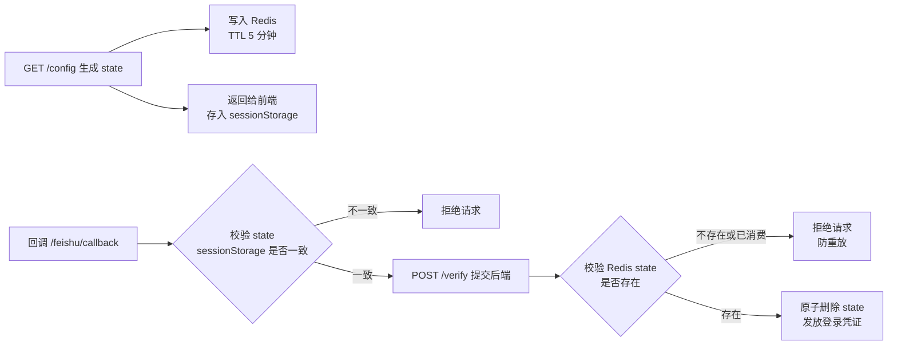

## 一、背景

越来越多的企业将飞书作为内部办公协作平台，员工日常已在飞书端完成身份认证。如果后台管理系统采用独立账号体系（用户名 + 密码），员工需要额外记忆一套密码，体验割裂。

通过接入飞书 OAuth 2.0 授权（参考[飞书 SSO 登录流程概览](https://open.feishu.cn/document/sso/web-application-sso/login-overview)），可以实现：

| 价值 | 说明 |
|------|------|
| **单点登录** | 员工无需记忆独立密码，扫码或一键授权即可登录 |
| **体验一致** | 与飞书生态无缝衔接，降低使用门槛 |
| **信息同步** | 登录时实时校正姓名、头像等信息 |
| **安全可控** | 飞书账号禁用后，系统登录自动失效 |

本文将以 OAuth 2.0 授权码模式为主线，从零到一拆解飞书登录的完整接入流程，包含前端实现、后端设计、安全防护和踩坑记录。

---

## 二、两种登录方式对比

系统登录页通常同时提供两种飞书登录方式，由用户根据当前场景自由选择：

| 登录方式 | 适用场景 | 交互方式 |
|----------|----------|----------|
| **一键授权登录** | 用户已在浏览器登录飞书网页版 / 桌面客户端 | 页面跳转到飞书 OAuth 授权页，确认后自动回调 |
| **二维码扫码登录** | 用户未在浏览器登录飞书 | 页面内嵌飞书二维码，手机扫码后自动完成登录 |

> **技术要点**：浏览器**无法主动检测**用户是否已登录飞书（跨域安全限制），因此登录页需同时提供两种入口。扫码登录需接入[飞书 QR SDK](https://open.feishu.cn/document/common-capabilities/sso/web-application-sso/qr-sdk-documentation)。

---

## 三、OAuth 2.0 授权码模式流程

飞书登录采用标准的 OAuth 2.0 授权码模式（Authorization Code Grant），通过[飞书开放平台 OAuth 2.0 授权接口](https://open.feishu.cn/document/sso/web-application-sso/login-overview)完成身份认证。

### 3.1 一键授权登录流程



### 3.2 扫码登录流程

扫码登录的前半段依赖[飞书 QR SDK](https://open.feishu.cn/document/common-capabilities/sso/web-application-sso/qr-sdk-documentation)，后半段与一键授权完全一致：



**两种方式的共同点**：
- 后端登录逻辑完全一致：前端携带 `code` + `state` 调用 `POST /verify`
- `OAuth 回调地址`配置为前端地址（如 `https://{domain}/feishu/callback`）
- `redirect_uri` 须与[飞书开放平台](https://open.feishu.cn/)「安全设置 → 重定向 URL」中配置的**完全一致**

---

## 四、前端实现

### 4.1 获取配置并跳转

登录页点击「飞书登录」时，先调用后端获取配置：

```javascript
// 获取飞书登录配置
async function getFeishuConfig() {
  const res = await fetch('/api/login/feishu/config')
  const { appId, authUrl, state, redirectUri } = await res.json()

  // state 写入 sessionStorage，回调时做二次校验
  sessionStorage.setItem('feishu_state', state)
  sessionStorage.setItem('feishu_redirect_uri', redirectUri)

  return { appId, authUrl, state, redirectUri }
}
```

### 4.2 一键授权登录

一键授权使用**当前页面直接跳转**的方式，而非弹窗：

```javascript
const { authUrl } = await getFeishuConfig()

// 直接跳转（非弹窗），避免 COOP 限制导致 opener 失效
window.location.href = authUrl
```

> **为什么不用弹窗？** 生产环境的 `Cross-Origin-Opener-Policy: same-origin` 响应头会导致弹出窗口的 `window.opener` 为 `null`，弹窗方案不可靠。

### 4.3 二维码扫码登录

扫码登录需要引入[飞书 QR SDK](https://open.feishu.cn/document/common-capabilities/sso/web-application-sso/qr-sdk-documentation)，在登录页嵌入二维码：

```javascript
// 引入飞书 QR SDK（通过 script 标签或 npm 包）
// SDK 会在指定 DOM 元素内渲染二维码 iframe

const { authUrl, appId } = await getFeishuConfig()

// 初始化二维码
const qrObj = QRLogin({
  id: 'qrcode-container',   // 二维码挂载的 DOM 元素 ID
  goto: authUrl,            // 扫码成功后跳转的授权 URL
  width: '250',
  height: '250',
})

// 监听 postMessage 获取扫码结果
window.addEventListener('message', (e) => {
  // 校验消息来源
  if (!qrObj.matchOrigin(e.origin)) return

  const tmpCode = e.data?.tmp_code ?? e.data
  if (typeof tmpCode !== 'string' || tmpCode.length < 10) return

  // 携带 tmp_code 跳转飞书授权
  window.location.href = authUrl + '&tmp_code=' + tmpCode
})
```

### 4.4 OAuth 回调处理

飞书授权后重定向到前端回调地址（如 `/feishu/callback`），前端在应用路由初始化前拦截处理：

```javascript
// 在路由初始化前拦截回调 URL
if (window.location.pathname === '/feishu/callback') {
  const params = new URLSearchParams(window.location.search)
  const code = params.get('code')
  const state = params.get('state')

  // 校验 state 与之前存入 sessionStorage 的一致
  const savedState = sessionStorage.getItem('feishu_state')
  if (state !== savedState) {
    localStorage.setItem('feishu_login_error', '非法请求，请重新登录')
    location.replace('/login')
    return
  }

  // 调用后端验证接口
  try {
    const res = await fetch('/api/login/feishu/verify', {
      method: 'POST',
      headers: { 'Content-Type': 'application/json' },
      body: JSON.stringify({ code, state }),
    })
    const data = await res.json()
    if (data.code === 0) {
      // 登录成功，存入 pending 让登录页读取
      localStorage.setItem('feishu_login_pending', JSON.stringify(data.data))
      location.replace('/login')
    } else {
      localStorage.setItem('feishu_login_error', data.msg)
      location.replace('/login')
    }
  } catch (err) {
    localStorage.setItem('feishu_login_error', '登录失败，请重试')
    location.replace('/login')
  }
}
```

---

## 五、后端实现

后端使用[飞书 Java SDK（oapi-sdk）](https://open.feishu.cn/document/uAjL4wCM/ukTMukTMukTM/server-side-sdk/java-sdk-guide/preparations)调用开放平台 API，SDK 会自动处理 `tenant_access_token` 的获取和缓存。

**Maven 依赖示例：**

```xml
<dependency>
    <groupId>com.larksuite.oapi</groupId>
    <artifactId>oapi-sdk</artifactId>
    <version>2.5.3</version>
</dependency>
```

### 5.1 获取飞书登录配置

**接口**：`GET /api/login/feishu/config`（免登录）

后端生成防 CSRF 的 `state` 随机串，同时组装完整的飞书 OAuth 授权 URL（参考[飞书 OAuth 授权接口文档](https://open.feishu.cn/document/sso/web-application-sso/login-overview)）：

```java
@GetMapping("/login/feishu/config")
@NoNeedLogin
public ResponseDTO<FeishuLoginConfigVO> getLoginConfig() {
    // 生成随机 state，写入 Redis（TTL 5 分钟）
    String state = UUID.randomUUID().toString().replace("-", "");
    redisTemplate.opsForValue().set(
        "feishu:login:state:" + state,
        String.valueOf(System.currentTimeMillis()),
        5, TimeUnit.MINUTES
    );

    // 从配置中心读取飞书应用信息
    String appId = configService.getConfig(ConfigKeyEnum.FEISHU_APP_ID);
    String redirectUri = configService.getConfig(ConfigKeyEnum.FEISHU_REDIRECT_URI);

    // 组装 OAuth 授权 URL
    String authUrl = UriComponentsBuilder
        .fromHttpUrl("https://passport.feishu.cn/suite/passport/oauth/authorize")
        .queryParam("client_id", appId)
        .queryParam("redirect_uri", URLEncoder.encode(redirectUri, StandardCharsets.UTF_8))
        .queryParam("response_type", "code")
        .queryParam("state", state)
        .queryParam("scope", "contact:user.base:readonly")
        .build()
        .toUriString();

    FeishuLoginConfigVO vo = new FeishuLoginConfigVO();
    vo.setAppId(appId);
    vo.setRedirectUri(redirectUri);
    vo.setState(state);
    vo.setAuthUrl(authUrl);

    return ResponseDTO.success(vo);
}
```

### 5.2 验证授权码并登录

**接口**：`POST /api/login/feishu/verify`（免登录）

核心流程为：校验 state → 调用[获取 user_access_token](https://open.feishu.cn/document/authentication-management/access-token/get-user-access-token) → 调用[获取登录用户身份](https://open.feishu.cn/document/server-docs/authentication-management/login-state-management/get) → 查本地员工 → 下发凭证：

```java
@PostMapping("/login/feishu/verify")
@NoNeedLogin
public ResponseDTO<LoginResultVO> feishuVerify(
        @RequestBody @Valid FeishuLoginVerifyForm form,
        HttpServletRequest request) {

    // 1. 校验 state，防 CSRF + 防重放
    String redisKey = "feishu:login:state:" + form.getState();
    String savedState = redisTemplate.opsForValue().get(redisKey);
    if (savedState == null) {
        return ResponseDTO.error("非法请求");
    }
    // 原子消费：删除后不可再用（防重放）
    redisTemplate.delete(redisKey);

    // 2. 用 code 换取 user_access_token
    // 注意：redirect_uri 必须与授权时完全一致
    FeishuTokenResponse tokenRes = feishuApiManager.exchangeCodeForToken(
        form.getCode(),
        configService.getConfig(ConfigKeyEnum.FEISHU_REDIRECT_URI)
    );
    if (tokenRes == null || !"success".equalsIgnoreCase(tokenRes.getStatus())) {
        return ResponseDTO.error("登录授权失败，请重试");
    }

    // 3. 获取飞书用户信息
    FeishuUserInfo userInfo = feishuApiManager.getUserInfo(tokenRes.getAccessToken());

    // 4. 查询本地员工（通过 feishu_union_id 映射）
    EmployeeEntity employee = employeeService.findByFeishuUnionId(userInfo.getUnionId());
    if (employee == null) {
        return ResponseDTO.error("您的飞书账号未绑定系统账号，请联系管理员");
    }
    if (employee.getDisabledFlag()) {
        return ResponseDTO.error("您的账号已被禁用，请联系工作人员");
    }

    // 5. 下发登录凭证（如 Sa-Token）
    LoginResultVO loginResult = authService.doLogin(employee);

    // 6. 异步校正员工信息（不影响登录主流程）
    CompletableFuture.runAsync(() -> {
        feishuLoginService.syncEmployeeFromFeishu(employee.getId(), userInfo);
    });

    return ResponseDTO.success(loginResult);
}
```

### 5.3 封装飞书 API 调用

建议统一封装飞书开放平台 HTTP 调用，核心涉及两个接口：

- [获取 user_access_token](https://open.feishu.cn/document/authentication-management/access-token/get-user-access-token)——用授权码换取用户级别的 token
- [获取登录用户身份](https://open.feishu.cn/document/server-docs/authentication-management/login-state-management/get)——通过 user_access_token 获取用户基本信息（`union_id`、`name`、`avatar_url` 等）

```java
@Component
public class FeishuApiManager {

    @Autowired
    private RestTemplate feishuRestTemplate;

    @Value("${feishu.app.id}")
    private String appId;

    @Value("${feishu.app.secret}")
    private String appSecret;

    /**
     * 用授权码换取 user_access_token
     * redirect_uri 必须与授权请求中的完全一致
     */
    public FeishuTokenResponse exchangeCodeForToken(String code, String redirectUri) {
        String url = "https://open.feishu.cn/open-apis/authentication/v2/oauth/token";
        // 此处需传入 redirect_uri，否则会报 redirect_uri_mismatch
        // 使用 application/x-www-form-urlencoded 格式
        MultiValueMap<String, String> params = new LinkedMultiValueMap<>();
        params.add("grant_type", "authorization_code");
        params.add("client_id", appId);
        params.add("client_secret", appSecret);
        params.add("code", code);
        params.add("redirect_uri", redirectUri);

        return feishuRestTemplate.postForObject(url, params, FeishuTokenResponse.class);
    }

    /**
     * 获取登录用户基本信息
     */
    public FeishuUserInfo getUserInfo(String userAccessToken) {
        String url = "https://open.feishu.cn/open-apis/authentication/v2/user/info";
        HttpHeaders headers = new HttpHeaders();
        headers.setBearerAuth(userAccessToken);

        HttpEntity<?> entity = new HttpEntity<>(headers);
        ResponseEntity<FeishuUserResponse> resp = feishuRestTemplate.exchange(
            url, HttpMethod.GET, entity, FeishuUserResponse.class
        );
        return resp.getBody() != null ? resp.getBody().getData() : null;
    }
}
```

---

## 六、安全设计

### 6.1 CSRF 防护（state）

OAuth 流程中，`state` 参数是标准的 CSRF 防护手段。本项目采用**双重校验**：



| 校验层 | 存储位置 | 作用 |
|--------|----------|------|
| 前端 | `sessionStorage` | 防 CSRF：URL 中的 state 与本地存储不一致时直接拒绝 |
| 后端 | Redis（TTL 5 分钟） | 防重放：verify 校验后原子删除，一个 state 只能用一次 |

### 6.2 redirect_uri 一致性

这是一个容易踩坑的点：

> 飞书[换 token 接口](https://open.feishu.cn/document/authentication-management/access-token/get-user-access-token)请求中的 `redirect_uri` 必须与**授权请求**和[开放平台配置](https://open.feishu.cn/)中的 `redirect_uri` **完全一致**（包括协议、域名、路径、尾部斜杠等）。

不一致会报 `redirect_uri_mismatch` 错误。

### 6.3 账号状态校验

登录时需检查员工账号状态：
- 未绑定：提示"联系管理员"
- 已删除：拒绝登录
- 已禁用：拒绝登录

---

## 七、踩坑记录

### 🕳️ 坑 1：弹窗 COOP 限制

**现象**：生产环境使用 `window.open()` 弹飞书授权页，授权完成后 `window.opener` 为 `null`，无法通信。

**原因**：生产环境配置了 `Cross-Origin-Opener-Policy: same-origin` 响应头，导致跨域弹窗的 `opener` 被隔离。

**解决**：改用 `window.location.href` 当前页面直接跳转。

### 🕳️ 坑 2：redirect_uri 不匹配

**现象**：调用[获取 user_access_token](https://open.feishu.cn/document/authentication-management/access-token/get-user-access-token) 时飞书返回 `redirect_uri_mismatch`。

**原因**：换 token 请求中 `redirect_uri` 参数与授权请求中的 `redirect_uri` 不完全一致（如尾部斜杠、大小写差异）。

**解决**：将 `redirect_uri` 统一从配置中心读取，确保授权和换 token 使用同一个值。

### 🕳️ 坑 3：扫码 tmp_code 校验不足

**现象**：偶尔收到非预期的 `postMessage` 数据，导致错误跳转。

**解决**：对 `tmp_code` 做基础校验 —— 确保是字符串且长度 >= 10，同时用 SDK 的 `matchOrigin` 校验消息来源。

### 🕳️ 坑 4：state 未及时清理

**现象**：用户在登录页刷新页面或打开多个标签页，旧 `state` 被重放使用。

**解决**：后端 `verify` 接口校验后**原子删除** Redis key，前端回调同时校验 `sessionStorage`，任一层校验不通过即拒绝。

### 🕳️ 坑 5：飞书 filter 接口参数格式

**现象**（部门同步场景可选参考）：调用飞书 `filter` 接口查询部门列表时（`POST /directory/v1/departments/filter`），参数中的 `value` 需传带引号的字符串，不能传纯数字，否则报 `Mismatch type string with value number`。

---

## 八、总结

飞书 OAuth 授权码模式接入本身并不复杂，核心链路可以概括为：

```text
获取配置 → 跳转授权 → 回调校验 → 换 token → 查用户 → 发凭证
```

但实际落地中，**安全防护**（双重 state 校验、防重放）和**边界情况**（COOP 限制、redirect_uri 一致性）才是真正需要关注的点。建议在开发时参考以下飞书官方文档：

| 文档 | 链接 |
|------|------|
| 飞书 SSO 登录流程概览 | [查看](https://open.feishu.cn/document/sso/web-application-sso/login-overview) |
| 飞书 QR SDK 接入文档 | [查看](https://open.feishu.cn/document/common-capabilities/sso/web-application-sso/qr-sdk-documentation) |
| 获取 user_access_token | [查看](https://open.feishu.cn/document/authentication-management/access-token/get-user-access-token) |
| 刷新 user_access_token | [查看](https://open.feishu.cn/document/authentication-management/access-token/refresh-user-access-token) |
| 获取登录用户身份 | [查看](https://open.feishu.cn/document/server-docs/authentication-management/login-state-management/get) |
| 飞书 Java SDK 使用指南 | [查看](https://open.feishu.cn/document/uAjL4wCM/ukTMukTMukTM/server-side-sdk/java-sdk-guide/preparations) |
| 飞书 OAuth 授权接口 | [查看](https://open.feishu.cn/document/sso/web-application-sso/login-overview) |

通过这套方案，可以实现员工使用飞书身份一键登录后台系统，提升内部系统的使用体验和安全水位。
