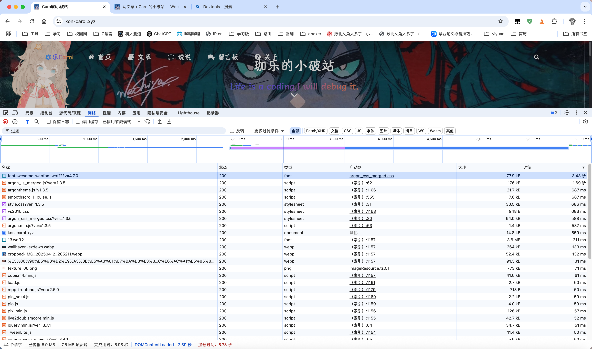
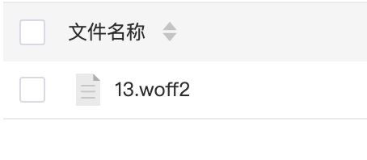
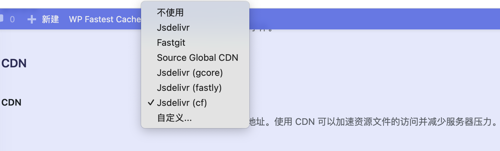

经过我的不屑努力，也是成功将我的网站从20多秒的加载延迟优化到了3秒左右的延迟了。接下来记录一下具体过程。

## 找到网站加载慢的原因

发现自己的网站加载慢，一定不要无脑去网上搜索优化教程。首先要确定是为什么自己的网站加载慢，我之前就是根本没有分析，直接跟着网上的教程走，优化了很久，发现根本没有作用。后来才利用Devtools分析各个资源的加载时间才解决。可以通过F12打开Devtools，右键清理缓存之后重新打开网站进行分析。

这里其实是我已经优化完之后的效果了，在优化之前，发现有许多.css、.js、字体文件加载很慢，所以优化的思路就是加快这几个的加载。

## 我的优化思路

对于字体文件，我的优化思路是将字体文件下载到自己的服务器中，然后更改CSS文件里面的URL路径就可以了。

其他的.css文件和.js文件我本来也是想着下载到服务器中的，但是后来发现在主题设置中可以选择CDN，在换了一个CDN之后，速度快了不少。

至此，我的网站速度也是成功从20多秒优化到了3秒，大功告成！！！

之前进行操作的时候忘记截图了，导致现在只有成品的图，要注意。
